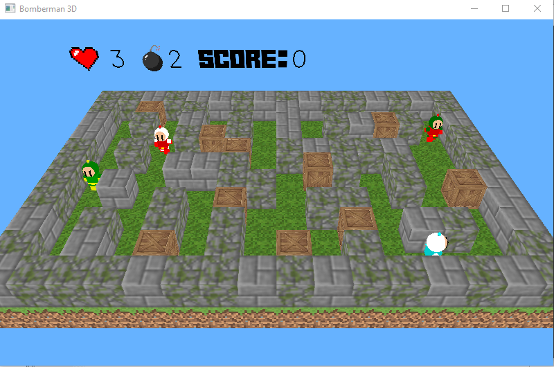
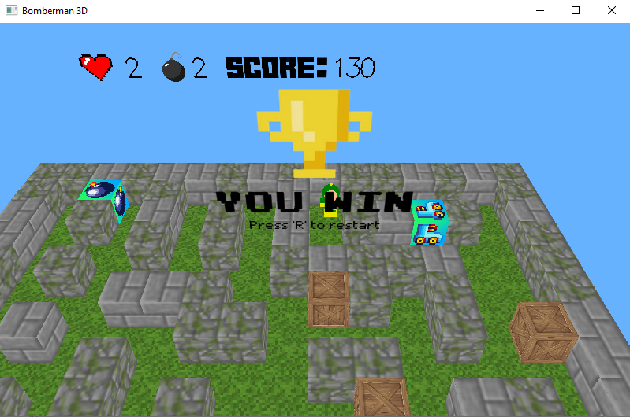
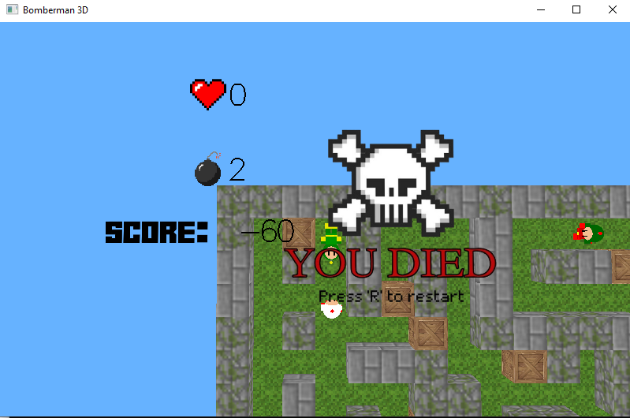
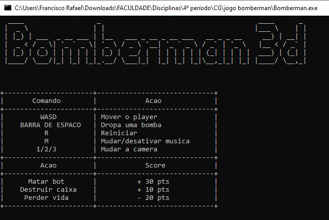

# Bomberman 3D 💣

**Bomberman 3D** é uma adaptação tridimensional do famoso jogo Bomberman, desenvolvido como projeto final da disciplina **Computação Gráfica**. Criado em **C++** utilizando a biblioteca **GLUT** do **OpenGL**, o jogo oferece uma experiência de combate e estratégia com visual 3D.

## 🎮 Descrição do Jogo
Neste jogo, o jogador controla um personagem em um ambiente 3D e deve **posicionar bombas** para:
- **Destruir caixotes**, que liberam **power-ups**.
- **Eliminar oponentes**, que causam dano ao jogador ao encostar nele.

O jogo oferece uma mistura de combate, estratégia e movimentação, com um **sistema de pontuação** baseado em suas ações durante as partidas.

## 🚀 Tecnologias
- **Linguagem**: C++
- **Biblioteca Gráfica**: OpenGL (GLUT)
- **IDE**: Falcon

## 🖼️ Imagens
- **Jogo em ação**:  
  

- **Tela de Vitória**:  
  

- **Tela de Derrota**:  
  

- **Tutorial de Controle**:  
  

## ⚙️ Como Executar
Siga os passos abaixo para rodar o jogo no seu ambiente:

1. **Clone o repositório** ou baixe os arquivos do projeto.
2. **Abra o projeto** na IDE **Falcon**.
3. **Compile e execute** o arquivo `main.cpp`.
4. **Siga as instruções no terminal** para começar a jogar.

## 👥 Integrantes
- **Bernardo de Carvalho Cavalcante**
- **Francisco Rafael Meneses Gonçalves**